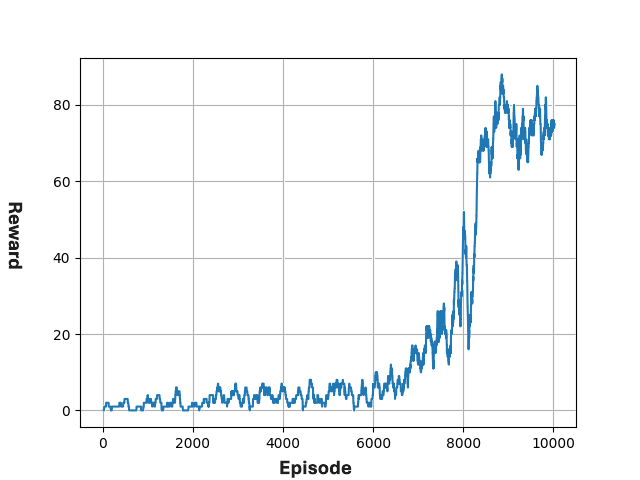

FrozenLake_RL 

## Proje Açıklaması
 Bu repo, Pekiştirmeli Öğrenme algoritmalarını matris tabanlı bir ortamda uygulamak için geliştirilmiştir. FrozenLake ortamında Q-Learning ve Deep Q-Network algoritmalarının eğitim süreçlerini detaylı şekilde incelemektedir. 
  Ortam hakkında bilgi edinmek için [FrozenLake](https://www.gymlibrary.dev/environments/toy_text/frozen_lake/)

## İçerik 
- Q-Learning: Tablosal öğrenme yaklaşımı
- Deep Q-Network: Sinir ağı tabanlı RL modeli
- FrozenLake Ortamı: Kaygan ve kaygan olmayan versiyonları
- Görseller: Eğitim süreçleri ve sonuçları

## Klasör Yapısı  
FrozenLake_RL/                        # Ana proje klasörü  
├── Q-Learning/                       # Q-Learning Yaklaşımı  
│   ├── egitilmis_modeller/           # İlgili haritalarda yürütülmeye hazır modeller  
│   │   ├── ...  
│   ├── gorseller/                    # Q-Learning algoritmasının ilgili haritalardaki çıktıları  
│   │   ├── ...  
│   ├── RLAgent.py                    # Q-Learning tabanlı kaynak kod  
├── DQN/                              # DQN yaklaşımı  
│   ├── egitilmis_modeller/           # İlgili haritalarda yürütülmeye hazır modeller  
│   │   ├── ...  
│   ├── gorseller/                    # DQN algoritmasının ilgili haritalardaki çıktıları  
│   │   ├── ...  
│   ├── DRLAgent.py                   # DQN tabanlı kaynak kod  
├── README.md                         # Proje tanıtımı ve açıklamalar  
├── gorsellestirme.py                 # Isı haritalarını elde etmeye yarayan kodlar  
├── map_4x4.png                       # Eğitimde kullanılan 4x4'lük harita  
├── map_8x8.png                       # Eğitimde kullanılan 8x8'lik harita  
├── map_11x11.png                     # Eğitimde kullanılan 11x11'lik harita  

## Örnek Bir İnceleme
Aşağıda, FrozenLake 4x4 ortamının, non_slippery versiyonuna ilişkin çeşitli sonuçlar gösterilmiştir.  

| FrozenLake 4x4 Haritası | Q-Learning Isı Haritası | Q-Learning Eğitim Grafiği | DQN Isı Haritası | DQN Eğitim Grafiği |
|-------------------------|-------------------------|---------------------------|------------------|-------------------|
|  |  |  |  |  |

Aşağıda, FrozenLake 4x4 ortamının, slippery versiyonuna ilişkin çeşitli sonuçlar gösterilmiştir.  

| FrozenLake 4x4 Haritası | Q-Learning Isı Haritası | Q-Learning Eğitim Grafiği | DQN Isı Haritası | DQN Eğitim Grafiği |
|-------------------------|-------------------------|---------------------------|------------------|-------------------|
|  |  |  |  |  |
